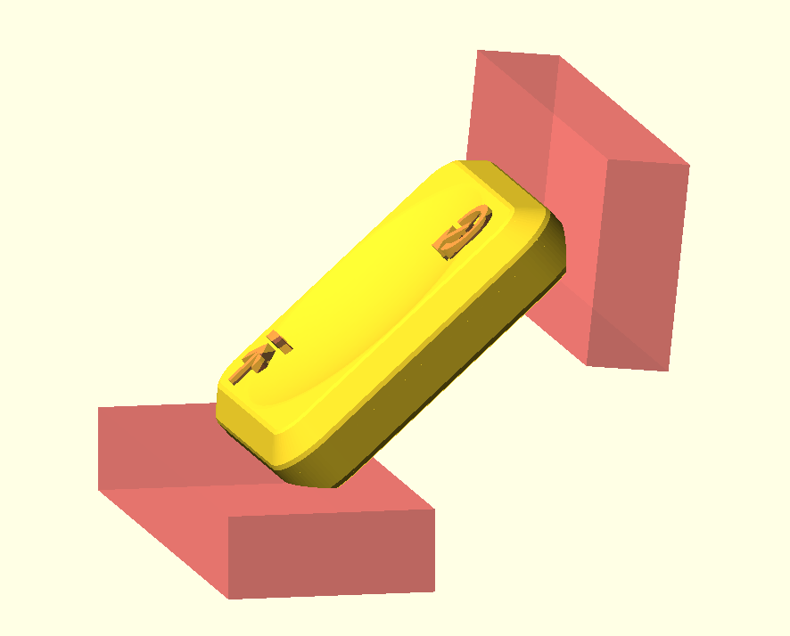

# Openscad labeled choc keycaps

> use the nightky build of openscad with the manifold backend, which is so much faster than the old CGAL backend

`keycaps.scad` takes pre-existing single keycap meshes (here `1u.stl` and `1.5u.stl`), a layout describing multiple keys (see `layout.cad`), then instantiate and label each key. it also add a bevel on the rear sides and rotates the key on it for 3d printing.

read the code for details on the input format and how the labeling works.

you might need to adjust the font - the code references `JetBrainsMono Nerd Font`. openscad has a Font List panel where you can test a font's support for specific characters.

The keycap model itself is a reimplementation in Onshape of the great KEA caps : https://github.com/klouderone/KEA-choc-keycaps

Before KEA I used LPX, another great opensource keycap: https://github.com/levpopov/LPX

I generated my layout.cad from the Vial layout  with a quick script.
